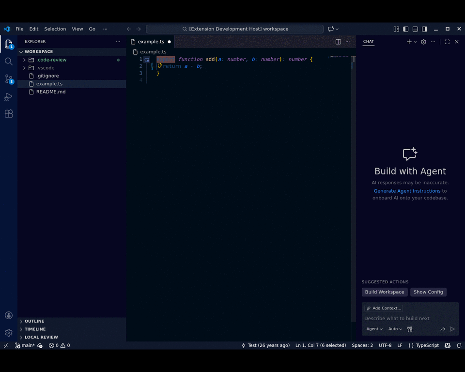
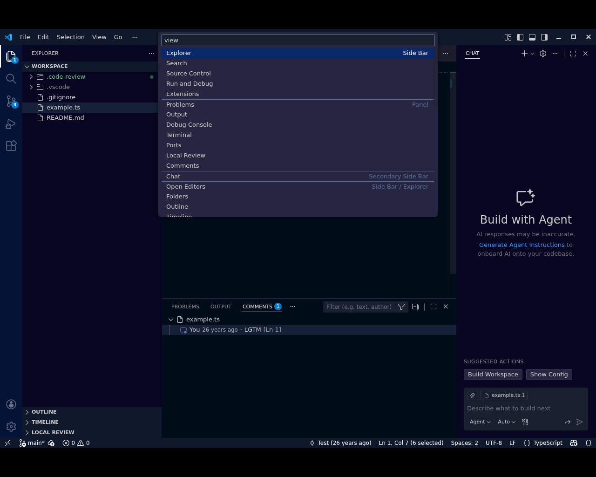

# Local Code Review (VS Code extension)

GitHub/Gerrit-style **inline review comments** for local code changes, stored alongside your project under `.code-review/` (configurable).

## Demo





## Features

- Inline threaded comments using VS Code’s native **Comments UI** (gutter indicators, collapse/expand, replies).
- “Local Review” Explorer + Panel views to list threads (grouped by file) and jump to them.
- Persisted comment threads on disk in `.code-review/threads/*.md` with a lightweight `.code-review/index.json`.
- Resolve/reopen threads, delete threads, and reveal threads in-editor.
- “Suggested changes” blocks (```suggestion) with an “Apply Suggestion” action.
- Optional diff-aware mode: restrict comment creation to **Git-changed hunks**.

## Usage

- Add a thread: select a range (or place the cursor on a line) → run **“Code Review: Add Comment”**.
- Reply: type into the inline comment box → press **Enter** or **Cmd/Ctrl+Enter**, or click **Save**.
- Discard draft: click **Discard**.
- Resolve/reopen: use the thread title actions (**Resolve** / **Reopen**).
- Apply suggestion: include a fenced block like:

````md
```suggestion
return a - b;
```
````

…then run **“Apply Suggestion”** from the thread actions.

- Browse all threads: open the **Explorer** sidebar → **Local Review**.
- Browse all threads (panel): open the **Panel** → **Local Review**.
- Clear everything: run **“Code Review: Clear All Comments”** (or use the view toolbar action).

## Where comments live on disk

The extension manages:

```
.code-review/
  AGENTS.md
  index.json
  threads/
    <threadId>.md
```

`AGENTS.md` is generated automatically and describes how LLMs should reply/resolve/close threads by editing the Markdown thread files.

## Configuration

- `localCodeReview.onlyCommentOnChanges` (boolean): restrict comment creation to Git diff hunks.
- `localCodeReview.storagePath` (string): workspace-relative directory for storing review data (default: `.code-review`). Set to `.vscode/.code-review` for the legacy layout.

## Development / CI / Publishing

- Dev workflow: `DEVELOPING.md`
- Packaging/publishing: `PUBLISHING.md`
